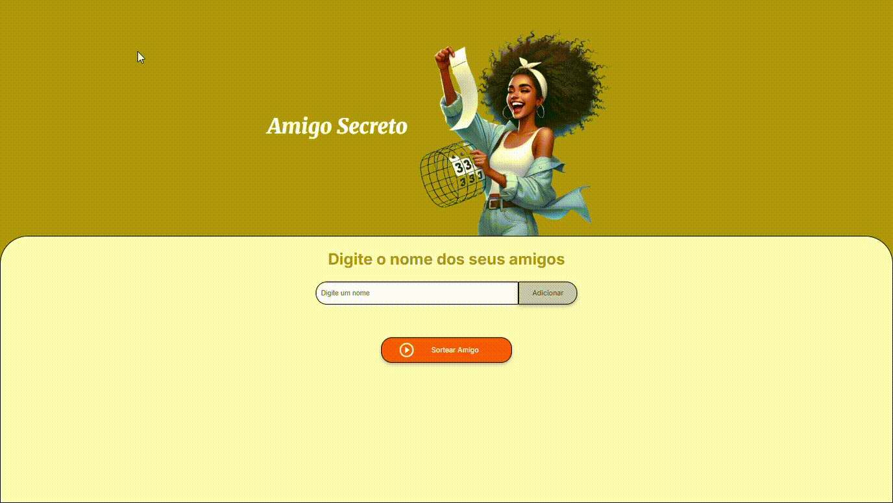

# Amigo Secreto 🎉

## 🗂️ Índice
- [Descrição do Projeto](#descrição-do-projeto)
- [Status do Projeto](#status-do-projeto)
- [Funcionalidades](#funcionalidades)
- [Demonstração da Aplicação](#demonstração-da-aplicação)
- [Acesso ao Projeto](#acesso-ao-projeto)
- [Tecnologias Utilizadas](#tecnologias-utilizadas)
- [Pessoas Contribuidoras](#pessoas-contribuidoras)
- [Pessoas Desenvolvedoras do Projeto](#pessoas-desenvolvedoras-do-projeto)
- [Licença](#licença)

---

## 📖 Descrição do Projeto
O **Amigo Secreto** é uma aplicação web simples e divertida que ajuda a organizar sorteios de amigo secreto entre amigos. Basta adicionar os nomes na lista e clicar no botão de "Sortear Amigo" para descobrir quem será o seu amigo secreto.

---

## 🚀 Status do Projeto
✅ Projeto finalizado e pronto para uso! Será que as coisas se finalizam mesmo? Ou sempre precisamos melhorar? Então, podemos questionar este status finalizado, não acham?

---

## ✨ Funcionalidades
- Adicione os nomes dos amigos para o sorteio.
- Sorteio aleatório entre os participantes.
- Interface amigável e acessível.
- Design responsivo para diferentes tamanhos de tela.

---

## 🎥 Demonstração da Aplicação

---

## 🔗 Acesso ao Projeto
Você pode acessar a aplicação a partir do seguinte link: [Amigo Secreto](https://degles.github.io/amigo-secreto-challenge/)

---

## 🛠️ Tecnologias Utilizadas
- HTML5
- CSS3
- JavaScript

---

## 🤝 Pessoas Contribuidoras
Aguardando sua participação para melhorar o projeto. POr ora, estou sozinho! :(
- Degles Siqueira - [GitHub](https://github.com/Degles)

---

## 👩‍💻 Pessoas Desenvolvedoras do Projeto
- Degles Siqueira - [GitHub](https://github.com/Degles)

---

## 📜 Licença
Este projeto está licenciado sob a licença MIT - veja o arquivo [LICENSE](LICENSE) para detalhes.

